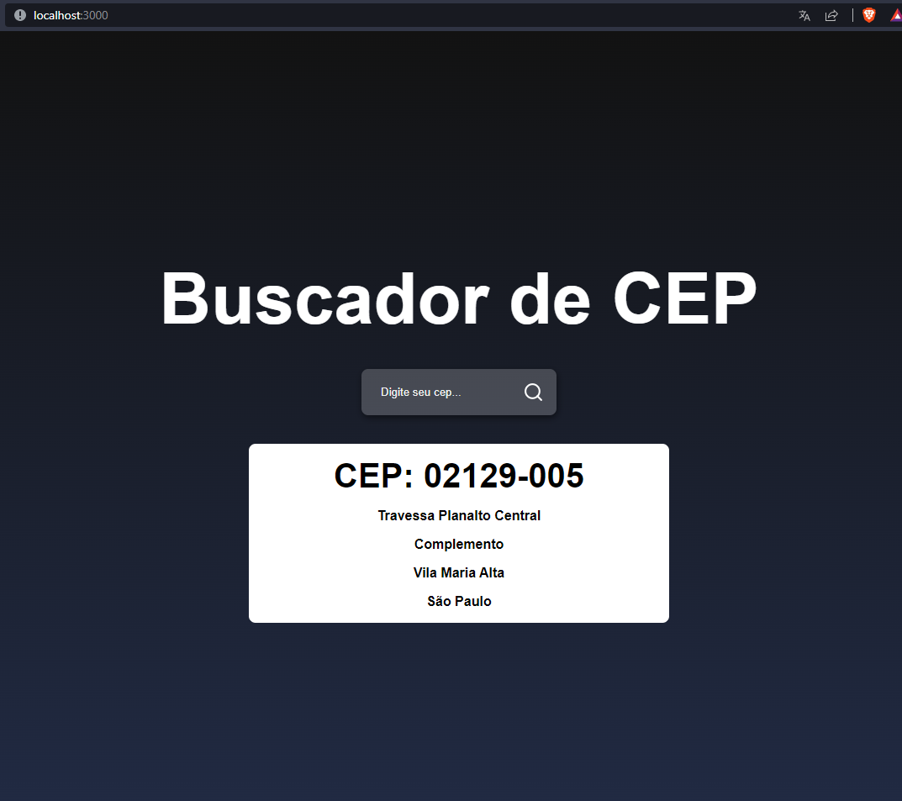

<h1 align="center"> Buscador de CEP </h1>

##  Tecnologias

Esse projeto foi desenvolvido com as seguintes tecnologias:

- HTML e CSS
- JavaScript
- React JS
- Git e Github
- API <a href="https://viacep.com.br/" target=_blank>(ViaCEP)</a>

## Projeto

> Desenvolvido apartir dos etudos no Canal <a href="https://www.youtube.com/@Sujeitoprogramador" target=_blank>Sujeito programador</a>

- [Acesse o projeto finalizado, online]()

- [Aula no Youtube](https://www.youtube.com/watch?v=oy4cbqE1_qc)

## Layout

</a>
